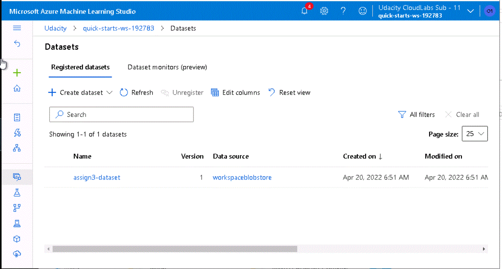
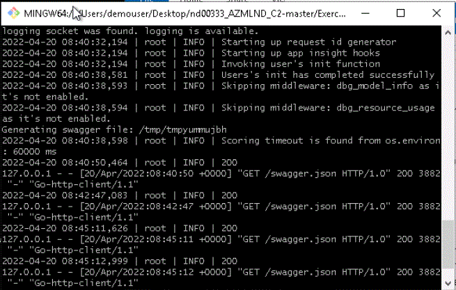
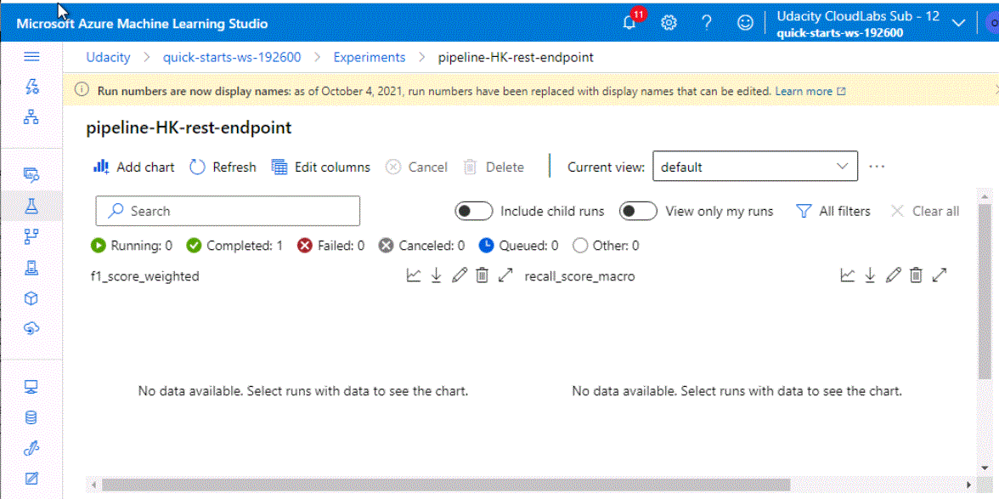

# Project 2: Operationalizing Machine Learning

## Table of Content
* [Project Overview](#project-overview)
* [Steps](#architectural-diagram)
    * [Authentication](#authentication)
    * [Automated ML Experiment](#automated-ml-experiment)
    * [Deploy the best model](#deploy-the-best-model)
    * [Enable logging](#enable-logging)
    * [Swagger Documentation](#swagger-documentation)
    * [Consume model endpoints](#consume-model-endpoints)
    * [Create and publish a pipeline](#create-and-publish-a-pipeline)
* [How to improve](#how-to-improve)
* [Screencast video](#screencast-video)
* [Used notebook](#used-notebook)

## Project Overview
This is the second project of the course Machine Learning Engineer with Microsoft Azure. In this project, we use Azure to configure a cloud-based machine learning production model, deploy it, and consume it. In the second part of this project, we will also create, publish, and consume a pipeline.

In this project, we will follow the steps below:

1. **Authentication** : With the Azure machine learning extension, one can create a Service Principal account, needed for the authentication.
2. **Automated ML Experiment** : Here, we will use AutoML to create a best fit model.
3. **Deploy the best model** : The model with the highest accuracy, will be deployed here so that it can be used with API.
4. **Enable logging** : Here we install Application Insights, which is used for logging.
5. **Swagger Documentation** : Swagger will be used to create the documentation for the deployed model.
6. **Consume model endpoints** : Here the endpoint model will be tested to get some predictions for 2 data points.
7. **Create and publish a pipeline** : In the final step, the above is created using a pipeline with the Python SDK.

## Steps

### Authentication
This step was skipped, since I used the Lab provided by Udacity.

### Automated ML Experiment
First, the data set [Bank Marketing data](https://automlsamplenotebookdata.blob.core.windows.net/automl-sample-notebook-data/bankmarketing_train.csv) was loaded as can be seen below:

Subsequently, Azure's AutoML was used to make a model. 

AutoML has ran several runs, and using the accuracy, selected the best performing mode, which was an VotingEnsemble.

The voting ensemble had an accuracy of around 95% and was subsequently used for the deployment. 

### Deploy the best model
In this step we will deploy the model with highest accuracy that was found in the previous step. This will be done using the Azure Container Instance, where we use Enable Authentication.

### Enable logging
In this step we enable Microsoft Application Insight which makes it possible to retrieve logs. This is done using a Python SDK and running the file logs.py, and adding a line "service.update(enable_app_insights=True)" to enable the Application Insight. The first screenshot shows the model without AI enabled, the second one shows the model with AI enabled, after running the logs

The output of the command was subsequently:

### Swagger Documentation
To get the best documentation of the API, we wanted to use Swagger. This is done by first downloading the swagger.json file which contains the information of our created endpoints. 

Subsequently, we need to run the swagger.sh and the serve.py files to let swagger create the documentation of the API. Below are screenshots of this process. It also shows the final swagger documentation page, with all the variables of the API endpoint.

### Consume model endpoints

Finally, we wanted to interact with the endpoint and give it two datapoints to test it. This was done in the file endpoint.py, which contained the information of the two datapoint. When I ran the python code, it gave me an error. (See below) I have spend the whole day, together with 2 mentors to solve this. But they could also not find the error. They also think it has to do with a bug with regards to Json file.

They suggested to instead show the test results of the deployed model in ML Studio (See screenshot below).

### Create and publish a pipeline
In the last step the above process was created using a Pipeline. So the best model for the given dataset was created, consumed and published using AutoML with Python SDK.

Below are the created endpoints:

## How to improve    

There are many different ways in which this project can be improved. For instance, we can compare the models a bit more in detail. So that we can improve on the accuracy. Also can we inspect the data a bit more in detail, to see whether further cleaning needs to be done. Furthermore, one could add in the SDK the option to add datapoints to the dataset, before building the model. This would make the whol workflow even more dynamic. So there is enough to be done. :-)

## Screencast video

I was not allowed (by my boss) to place my screencast video on youtube, and therefore I placed it in my github environment.

## Used notebook  

The notebook that I used for the pipelines can be found in my github repository.

