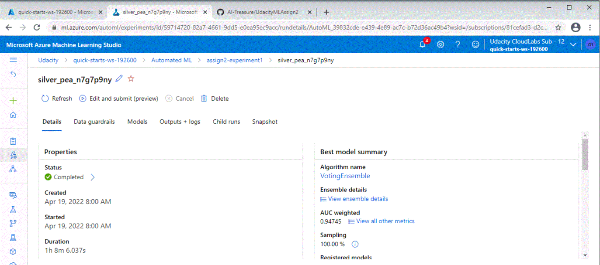

# Project 2: Operationalizing Machine Learning

## Table of Content
* [Project Overview](#project-overview)
* [Key Steps](#architectural-diagram)
    * [Authentication](#authentication)
    * [Automated ML Experiment](#automated-ml-experiment)
    * [Deploy the best model](#deploy-the-best-model)
    * [Enable logging](#enable-logging)
    * [Swagger Documentation](#swagger-documentation)
    * [Consume model endpoints](#consume-model-endpoints)
    * [Create and publish a pipeline](#create-and-publish-a-pipeline)
* [Screen Recordin](#screen-recording)
* [Standout Suggestions](#standout-suggestions)

## Project Overview
This is the second project ofthe course Machine Learning Engineer with Microsoft Azure. In this project, we use Azure to configure a cloud-based machine learning production model, deploy it, and consume it. In the second part of this project, we will also create, publish, and consume a pipeline.

In this project, we will follow the steps below:

1. **Authentication** : With the Azure machine learning extension, one can create a Service Principal account, needed for the authentication.
2. **Automated ML Experiment** : Here, we will use AutoML to create a best fit model.
3. **Deploy the best model** : The model with the highest accuracy, will be deployed here so that it can be used with API.
4. **Enable logging** : Here we install Application Insights, which is used for logging.
5. **Swagger Documentation** : Swagger will be used to create the documentation for the deployed model.
6. **Consume model endpoints** : Here the endpoint model will be tested to get some predictions for 2 data points.
7. **Create and publish a pipeline** : In the final step, the above is created using a pipeline with the Python SDK.

## Steps

### Authentication
This step was skipped, since I used the Lab provided by Udacity.

### Automated ML Experiment
First, the data set [Bank Marketing data](https://automlsamplenotebookdata.blob.core.windows.net/automl-sample-notebook-data/bankmarketing_train.csv) was loaded as can be seen below:

Subsequently, Azure's AutoML was used to make a model. 

AutoML has ran several runs, and using the accuracy, selected the best performing mode, which was an VotingEnsemble.

The voting ensemble had an accuracy of around 95% and was subsequently used for the deployment. 

### Deploy the best model
In this step we will deploy the model with highest accuracy that was found in the previous step. This will be done using the Azure Container Instance, where we use Enable Authentication.

### Enable logging
In this step we enable Microsoft Application Insight which makes it possible to retrieve logs. This is done using a Python SDK and running the file logs.py, and adding a line "service.update(enable_app_insights=True)" to enable the Application Insight.

The output of the command was subsequently:

### Swagger Documentation
To get the best documentation of the API, we wanted to use Swagger. This is done by first downloading the swagger.json file which contains the information of our created endpoints. 

Subsequently, we need to run the swagger.sh and the serve.py files to let swagger create the documentation of the API. Note though that I did not entirely manage to do this. As you can see in the below screenshot, I did manage to get the generic swagger file on. But when running the serve.py file, the file froze and the swagger file did not update anymore. I expect this to be because of the por settings that were not correctlys set. I did not have any time to solve this, so I continued the excercise.

### Consume model endpoints

Finally, we wanted to interact with the endpoint and give it two datapoints to test it. This was done in the file enspoint.py, which contained the information of the two datapoint. When I ran the python code, it gave me an error. Upon asking, it turned out that there is an error in the Microsoft code, which does not allow the data points to be given in a different order than is given in the dataset from the csv file. But I only found out after  my session had ended and I could not implement this anymore. The file that I used is in the repository to check.

### Create and publish a pipeline
In the last step the above process was created using a Pipeline. So the best model for the given dataset was created, consumed and published using AutoML with Python SDK.

Below are the created endpoints:

